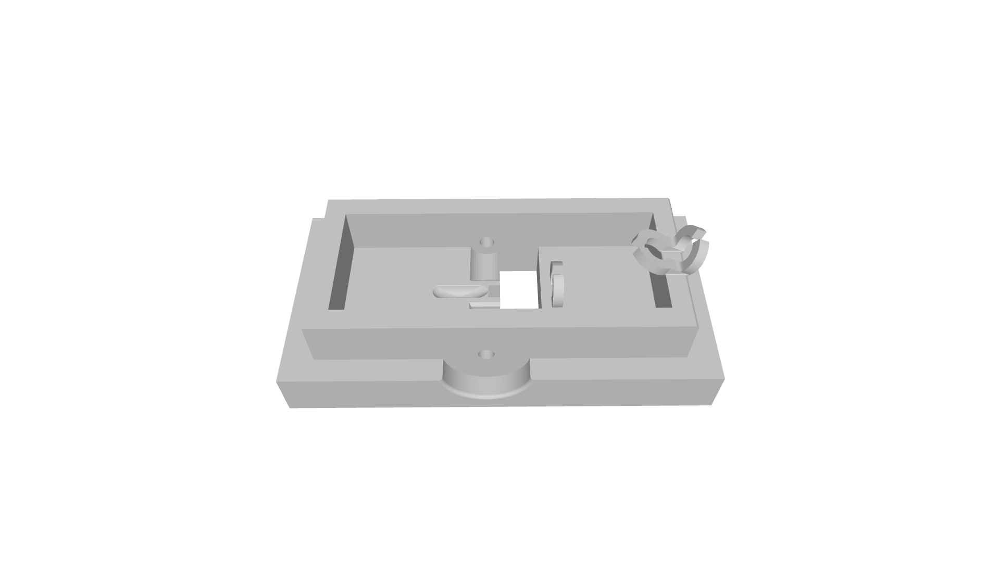
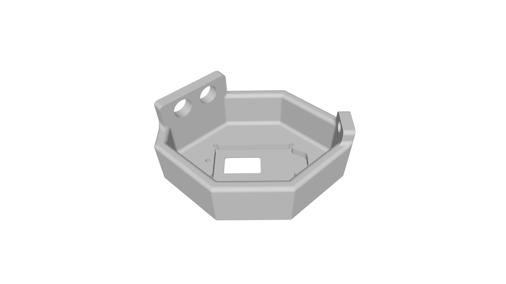
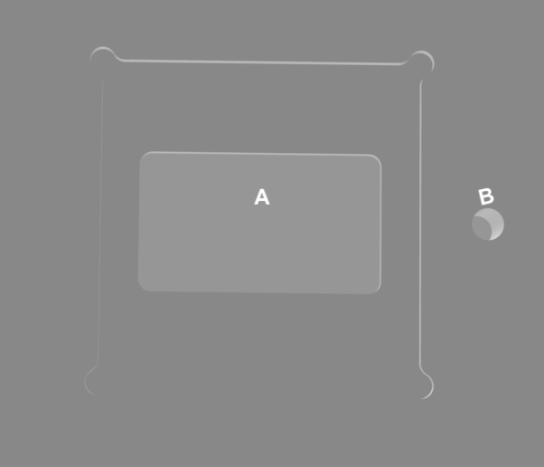
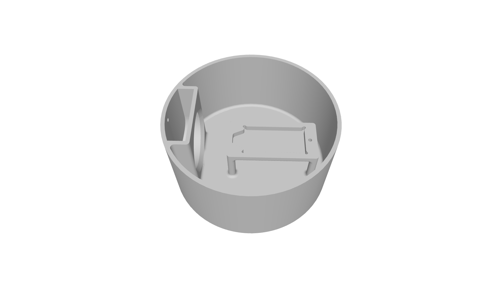
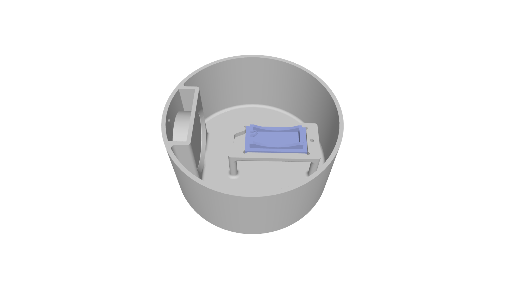
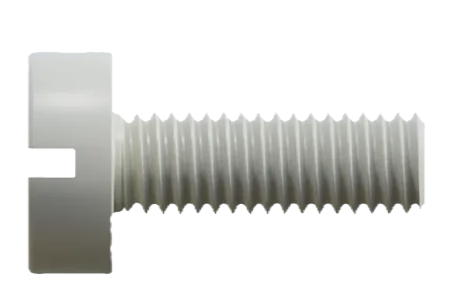
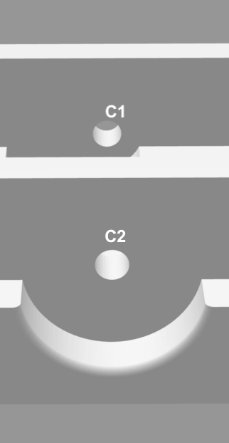
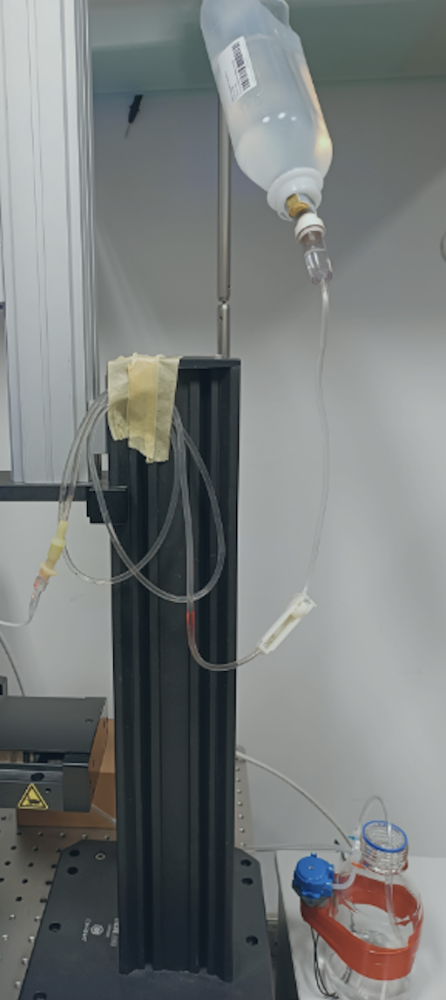

# CranioDock: Open-Source 3D-Printable Mounts for Brain Imaging with Visual and Auditory stimulation in Danionella

**CranioDock** is an open-source, modular 3D-printed mounting system designed for brain imaging in adult *Danionella* fish (and other similar animal models). This setup provides stable head-fixation, precise alignment with visual/ auditory stimuli, and easy integration with upright microscopes with water immersion or dry objectives that have sufficient working distance.

This repository contains all the necessary STL and STEP files to fabricate and assemble the mounting system, along with notes on assembly and experimental usage.

---

## Parts

| Part Name                         | File Path |
|----------------------------------|------------|
| Inner fish holder (common)                | `models/fish-holder_v2-m.STL`                 |
| Outer chamber (for visual stimulation)    | `models/visualStim_intubation-chamber_v2.STL` |
| Outer chamber (for auditory stimulation)  | `models/auditoryStim_outer-chamber_complete-setup_v3.STEP`|

Tip 1: if you do not have an in-house 3D printing facility, I can recommend Protolabs Network (previously called 3D HUBS) - I've had a good experience with 3D HUBS in Europe.

---

## Assembly Guide

- This is the inner fish holder that secures the fish and it is common to both the outer chambers - visual and auditory. A cover slip is used to cover the exposed surface (for visual stimulation) at bottom of the holder.

  

    
  

- This is the outer chamber for visual stimulation where the inner chamber fits in:

  

    
  

- For the outer visual stimulus chamber, an additional cover slip is needed to cover **A**. **B** is a space to attach a spring lock to hold the inner chamber in place. Only a food grade silicone sealant is used (Dow Corning 786) wherever sealing is necessary.

  

    
  

- The auditory stimulus chamber is as follows with a space for holding the underwater speaker and a stage for fitting the inner fish chamber with the fish facing the speaker. A small threaded hole is provided to lock the speaker in place when it is immersed in water.

  

    
  

- An illustration of the complete auditory setup is below:

  

    
  

---

## Experimental Use

- Compatible with upright objectives. Designed for functional calcium imaging in *Danionella* (and other similar animal models) with visual and auditory stimulus delivery.
  
- Nylon screws displayed below (RS PRO M2 x 16.0mm Slotted Pan Head Screw, 0.40mm Thread Pitch, Nylon) are used to a) support the anesthetized fish to stay upright during mounting and b) protect the gills from agar.

    

    
    

    
- These screws are inserted from either side (positions C1 and C2) to support the anesthetized fish upright in the center:

    

    
    
    

- Firstly, the fish is anesthetized before transferring them to the inner fish holder for mounting. Once moved to the fish chamber, it is positioned between the two screws covering the gills and the water is removed before application of 2.5% agar.

- The trunk of the fish (behind the screws covering the gills) is now completely immersed in 2.5% agar and a few drops of the agar is added in the anterior part of the mount - between the fish head and the gap left for the visual stimulation screen. Once agar is settled, remove the nylon screws and clear any remnants of agar around the gills and also around the mouth.

- After this, the tricaine anesthetic is washed off and the fish embedded in the holder is transferred to the appropriate outer chamber for brain imaging.

- Intubation-compatible: chamber slots accommodate tubings for perfussion of fish system water. The inflow is gravity-based using a simple over-the-counter saline container and an IV administration set. The system water is continuously drained out using 6VDC/ 5W peristaltic pump set at a constant height in the imaging chamber.

    

    
    

- For long-term imaging studies, the prep can benefit from oxygenation and temperature control, which were not implemented in our current system where acquistions lasted for short time intervals where fresh system water maintained at room temperature was continuously provided.

Tip 2: freeing too much of the gills and/or mouth will cause a lot of motion artifacts. This step is critical for good imaging and needs to be done carefully.

Tip 3: the mount is used on ~4 to 12 months old adult (male) fish. The younger adults (~2 months or so) can be significantly smaller in size and still growing. If using on such a stage of the fish, the size of the nylon screw used in the mount needs to be adjusted accordingly.

---

## License

This project is shared under the [Creative Commons Attribution 4.0 International License (CC BY 4.0)](https://creativecommons.org/licenses/by/4.0/).

---

## Author

Developed by Gokul Rajan. Orger Lab, Champalimaud Foundation.

---

## Citation

Gokul Rajan. (2026). CranioDock: Open-Source 3D-Printable Mounts for Brain Imaging with Visual and Auditory stimulation in Danionella (v1.0.0). Zenodo. https://doi.org/10.5281/zenodo.18178642

---

## Acknowledgement

This project was developed at the Champalimaud Foundation (CF) in the Vision to Action Laboratory of Michael B. Orger. Thanks to the Hardware Platform (especially Filipe Mendes) for translating my design into CAD models and fabricating the parts. Thanks also to Lucas Martins for creating a CAD model of an early version of my design. All of their advice was very much appreciated.
